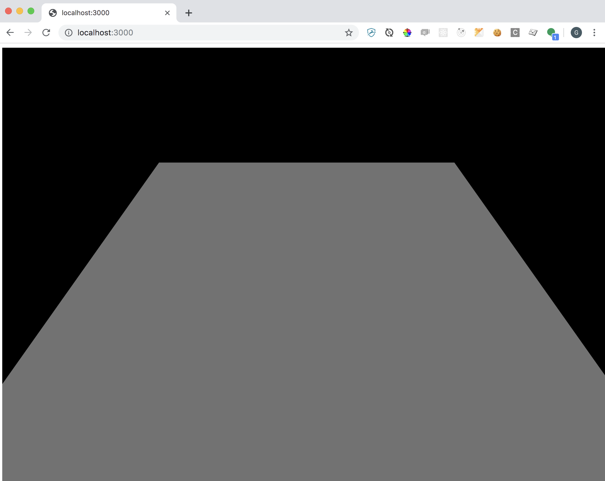
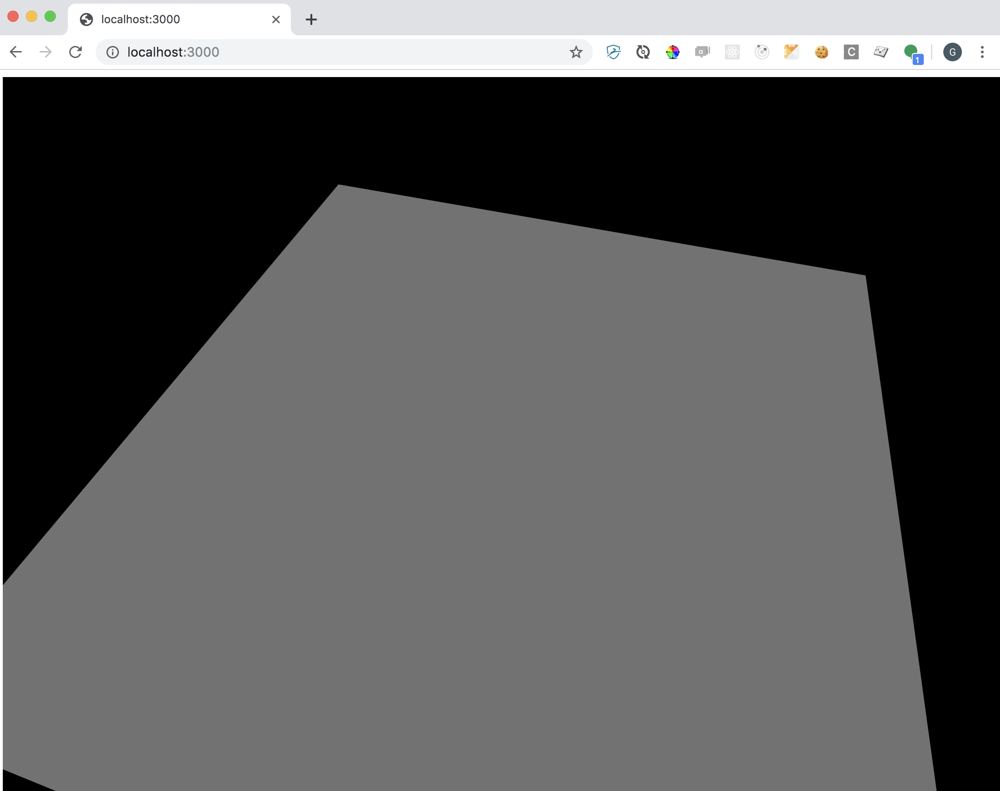
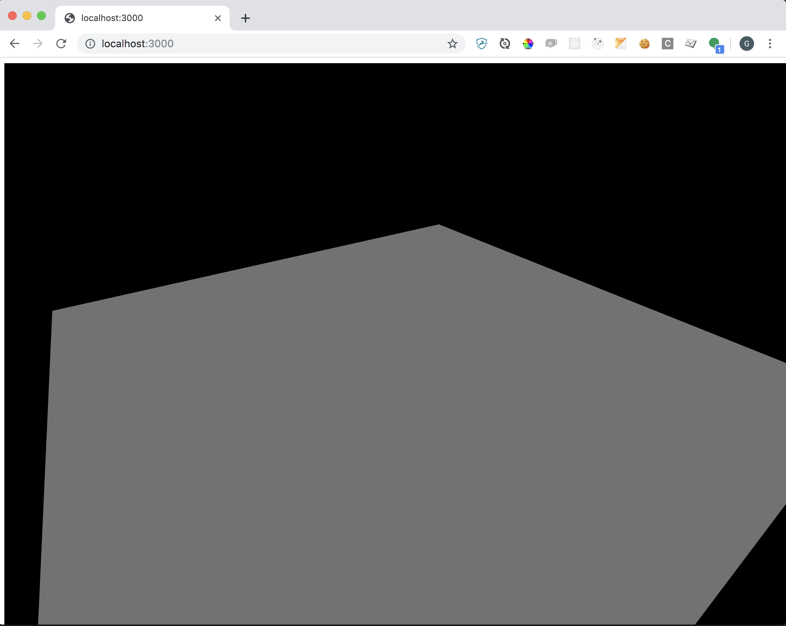
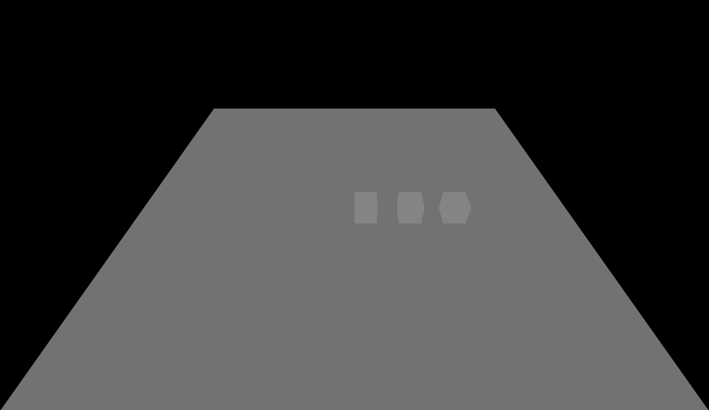
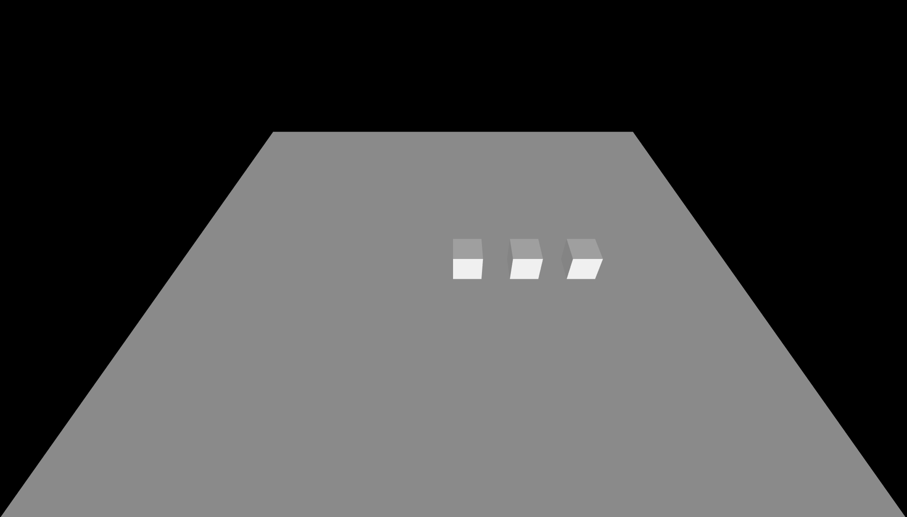
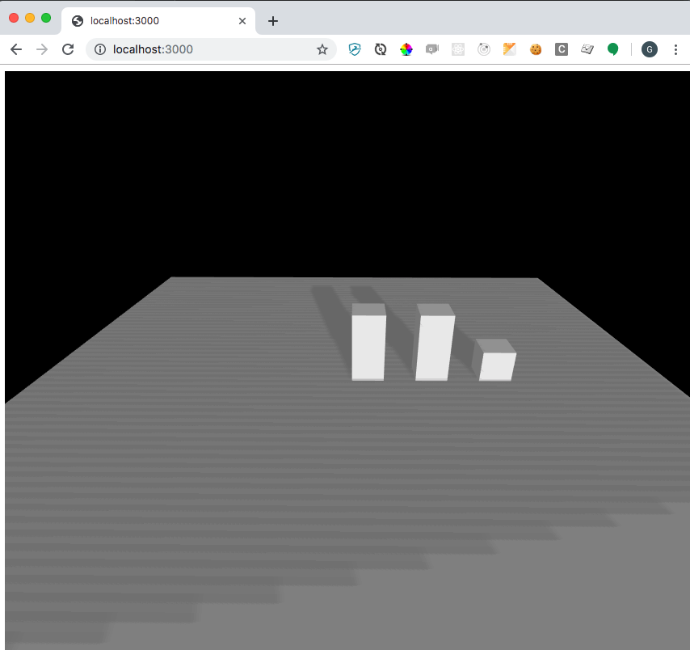
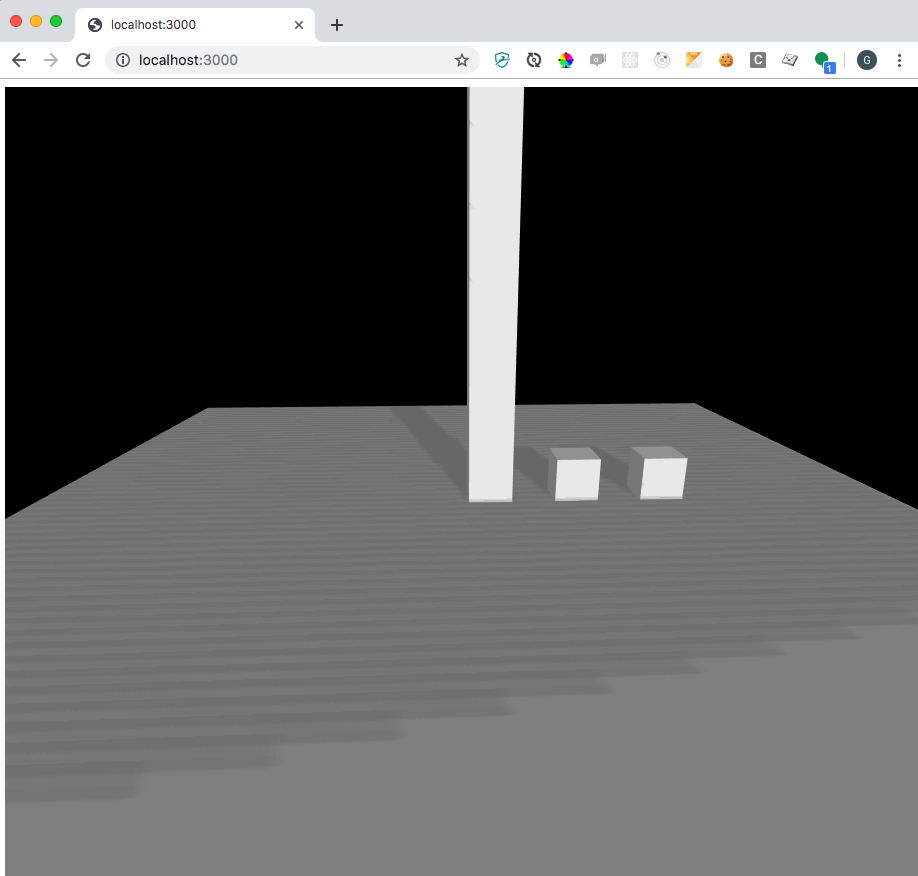
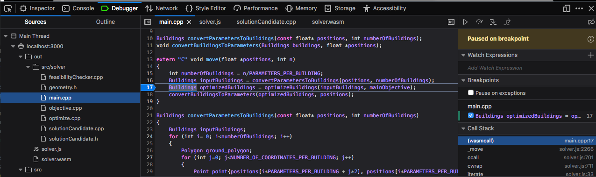

# WebAssembly course

In this course you will get an introduction to WebAssembly and 3D visualization using Three.js.

WebAssembly is a binary compilation format which lets you run languages like C, C++ and Rust in the browser.
This means existing code can be used in web application and possibilities for increased performance by using lower-level languages than JavaScript.
Three.js is a highly successful library which is used to create 3D applications which run in the browser.

At Spacemaker we use Three.js in large parts of our applications to let our users interact buildings on
building sites, and to visualize analysis of the buildings. WebAssembly is an emerging technology
which we have done some experiments with and are considering to include in our product.

In the first part of the course we will give you an introduction to WebAssembly and Three.js, and in the
the second part you will finish a project which combines both these technologies to find an optimal
utilization of a building site. (no prior knowledge about WebAssembly, Three.js or optimization is required.)

## Usage

Install dependencies with `npm install` and [`emcc`](https://emscripten.org/docs/getting_started/downloads.html)

Build the code with `./build.sh`

Start a web server `npm run start`

Open your browser on `http://localhost:3000`

## Assignment

The assignments in this workshop have 2 parts. In part 1 you will go through a set of 8 small tasks where you fill in
missing parts of code. When you have completed task 8, you will have a program which searches and visualizes
the iterations until an optimal solution is found.

The second part builds on the foundation in part 1 with more advanced tasks.
Here we have put together independent tasks so that you can choose the task
you would like to try based on what interests you.

---

## Part 1

### 1. Rendering the scene

#### Description 
At the center of all 3D applications is the `render` call. It tells your CPU
to update the scene and geometry on the GPU, and to schedule a rendering pass.
This will result in a 3D image being written to the framebuffer of the GPU.
This framebuffer will be mapped to the screen.

#### To do

Go to the file `visualize.js` and add the following line at the end of the `init` function
```
renderer.render(scene, camera)
```

#### Validation

When you have completed this task, your browser should look like this




### 2. Implementing the render loop

#### Description
The render method must be called each time we want to update the image on
the screen. This is usually done in a render loop running at 60 frames per
second. This means that the render function will be called every ~16 ms
and can't take more time to finish. If it takes more time, we will get
less than 60 fps, which might result in noticeable lag.

The browser has a function called `requestAnimationFrame`. This function
is intended to be used for animations. Using it will ensure that our
render loop runs at the same frequency as our monitor, which is usually
60 fps.

#### Todo
**A)** Go into the file `visualize.js`, add the following function definition into the `init` function
```javascript
  function render() {
    controls.update();
    renderer.render(scene, camera)
  }
```
 We have to make this render function call on itself for a continuous render, so add `requestAnimationFrame(render)` as the last line in the function.
 
**B)** Now you can replace the call to `renderer.render` from task 1 with a call to your new function `render`.

#### Validation
When you have completed this task, you should be able to move around in your scene with the mouse. 



### 3. Building the scene

#### Description
A `Three.js` object consists of two main properties. The `geometry`
describes the location and shape of the object, while the `material`
describes how it looks. There is more than one way of building these
objects. In this task we will use a `THREE.Shape` which defines
a 2d shape on a plane. And a `THREE.ExtrudeGeometry` to extend the shape
with a height. This corresponds to a building with a uniform height (flat roof) and vertical
walls.

The data model for our houses is a 2d ground polygon plus the height
of the building. These are flattened into a list of numbers
(`[x0, y0, x1, y1, x2, y2, x3, y3, height, ... ]`). The first building
is at indexes 0-8 in the array, the second at 9-16 and so on.

#### To do
The goal is to build the 2d ground polygon. Go into the file `extrude.js`, and into the function `createBuilding`. 
The `THREE.Shape` object has a `moveTo(x, y)` and `lineTo(x, y)` method. 
Think of this as if you where drawing on paper. 
`moveTo` moves your pencil without touching the paper, `lineTo` will draw a straight line from your current position to the new point.

#### Validation
When you have completed this task, your browser should look like this.




### 4. Adding a directional light

#### Description
The light source in the scene is an Ambient light. This will uniformly
light every object in the scene. It is a convenient light to add to emulate
real light conditions and enhance shadows. However, real lighting situations
have a source of light. We will add a Directional Light source to emulate
sun light, which is a source far away from our scene.

We want our Directional Light to cast shadows. This takes a bit of code to
set up for nice results. The gist is that the GPU creates the light source
by placing an Orthographic Camera at the position of the light source and takes
a picture of the scene. Every thing that it sees is deemed to receive light
and the rest is shadow. This technique is called shadow mapping.
The parameters we set on `light.shadow.camera` is the size of this camera.

In addition to configuring the light source we need to set `receiveShadow`
and `castShadow` to `true` on each object which should receive and cast
shadows respectively.

#### To do
**A)** Go to the file `visualize.js` and add the following lines to the function `createLight` right after the creation of the ambient light.
```javascript
  const light = new THREE.DirectionalLight(0xffffff, 0.45);
  light.position.set(80, 20, 20);
  light.castShadow = true;
  const size = 200;
  light.shadow.camera.near = 10;
  light.shadow.camera.far = 1000;
  light.shadow.camera.left = -size;
  light.shadow.camera.right = size;
  light.shadow.camera.top = size;
  light.shadow.camera.bottom = -size;
  group.add(light);
```

**B)**
The building mesh (`THREE.Mesh`) created in the `createLight` function must have `receiveShadow` and `castShadow` set to `true.

#### Verification

When you have completed task **A** and **B**, your browser should look like this, respectively.




### 5. Compile and run the wasm module
#### Description
Our search algorithm (solver) is located in `src/solver`. If we jump into the file `src/solver/main.cpp`, we can see the main function `move` at the top.
We want to be able to call this function from our javascript code.
To be able to do this, we need to **build** the c++ implementation.

Running the [`build.sh`](build.sh) script will create two files in the [`out`](out) folder: 

**1)** The file  `solver.wasm`, a WebAssembly binary of the search algorithm located in `src/solver`

**2)** The file `solver.js` (Javascript wrapper) in the [`out`](out) folder.

The js wrapper generated by `emcc` exposes a method called `cwrap`.
We can use this method to generate a javascript wrapper of the
function the WebAssembly module exposes, which in our case is the `move function.

The signature for the `cwrap` function is as follows:

```
cwrap(ident, returnType, argTypes[, opts]);
```

**Arguments:**

- `ident` – The name of the C function to be called.
- `returnType` – The return type of the function. This can be "number", "string" or "array", which correspond to the appropriate JavaScript types (use "number" for any C pointer, and "array" for JavaScript arrays and typed arrays; note that arrays are 8-bit), or for a void function it can be null (note: the JavaScript null value, not a string containing the word “null”).
- `argTypes` – An array of the types of arguments for the function (if there are no arguments, this can be omitted). Types are as in returnType, except that array is not supported as there is no way for us to know the length of the array).
- `opts` – An optional options object, see [`ccall()`](https://emscripten.org/docs/api_reference/preamble.js.html#ccall).

**Returns:**

- A JavaScript function that can be used for running the C function.


#### To do
**A)** Run the [`build.sh`](build.sh) script

**B)** Go into the file `src/solver/solver.js`, import the solver module located in `out/solver.js` (this is the default import) at the top of this file.

**C)** The module you just imported is a function which creates an instance when called. Create such an instance, i.e. `const instance = Module();`. 

**D)** Your newly created instance contains a method called `cwrap`, use it to create a wrapped version of the `moe` function, i.e. 
```
const wrappedMove = instance.cwrap(<arguments here>)
```
Hint: Task **E** in combination with the **description** might help you figure out what the arguments to cwrap should be.

**E)** Make a call to `wrappedMove` inside the `iterate` function defined inside `init`.
`wrappedMove` has two arguments, the first is a pointer to the memory location, the second is the number of buildings.

**F)** Go into `src/main.js` and import the solver you just finished in **E** the same way as `Visualize` is imported.

**G)** Call the `init` method on the imported solver, this method is async and thus it returns a promise. 
In js you can handle this by piping the promise with the [`then`](https://developer.mozilla.org/en-US/docs/Web/JavaScript/Reference/Global_Objects/Promise/then) function.
In our case, the value returned by the promise is an instance of the solver object defined in `src/solver/solver.js`, on which we can call the `iterate` method.                                                                                                                                  

#### Validation
When you have completed task **G** you should see a small movement on one of the buildings straight after refresh, you might have to refresh several times to see it.

### 6. Multiple iterations
In task **5** you managed to run one iteration of the solver, but of course we want the solver to run multiple iterations. It is also cool to be able to see what happens in each iteration, thus we want to add a pause between each call to the iterate function. 

#### To do
Use the javascript [`setInterval`](https://developer.mozilla.org/en-US/docs/Learn/JavaScript/Asynchronous/Timeouts_and_intervals#setInterval()) method to run an iteration every second.

#### Validation
The buildings should be moving up and down on your screen, the search is not deterministic right now, but they might end up like this.



### 7. Add new solution candidates to list

The solver takes some buildings as input, tries to improve the buildings by changing the building heights, and then
returns the buildings with updated building heights.

In the file `optimize.cpp`, the solver first looks for possible new solutions by changing one building height. It then
looks for new solutions where the change of the first building is combined with a height change in a second building.
The list `solutionCandidates` is supposed to collect all of these potential new solutions.

The solver must take some restrictions into account, i.e. it must comply with certain rules. When none of the
restrictions are broken, we say that the solution is "feasible". As the solver is implemented, the height of each
building must be within a min and max value. When the solver has generated potential solutions, the best feasible
solution from the `solutionCandidates` list is returned.

Right now, one of the new solutions are added to the `solutionCandidates` list. Add the missing code so that the new
solutions are added to this list.

Hint: A function called `addSolutionCandidatesToList` is already implemented.

### 8. Make volume the objective function

The objective value is a value that says how good a solution is. The objective function states how the objective value
should be calculated. As we want the solver to maximize the objective value, it means that the higher the objective value
is, the better is the solution.

When the objective is `VOLUME`, the solver should return the solution with the most volume. This means that the
objective function should calculate the volume of the buildings. Correct the return statement in `cost.cpp` so that the
total volume is returned.

Hint: Check out the `getTotalVolume` function.

---
## Part 2
Choose one or more of the following tracks. 
**Tip:** it might be a good idea to **commit** what you have done until now, so that you can always go back to something that works.

## THREE.js Track

### 1. Custom shaders - color the building walls with the distance to a bus stop
Uncomment the lines in src/visualize/extrude.js to use the custom shaders in customShaders.js. 
Complete the vertex and fragment shaders to color the building walls with a shade of green growing 
darker the further away that pixel is from the bus stop 

## WebAssembly Track

### 1. Loading a WebAssembly module
#### Description
In part 1 we compiled C++ to WebAssembly and loaded it into the browser with 
the `emscripten` toolchain. This does a lot of the heavy lifting on our behalf
by both loading and wrapping the wasm module with a JavaScript wrapper.

Lets take a look at a much simpler example so that we can load and wrap the wasm
module ourselves.


#### To do
**A)** Compile the wasm module by running the following in the terminal
```bash
emcc -Os -s EXPORTED_FUNCTIONS='["_move"]' src/simple/simple.c -o src/simple/simple.wasm
```
This will create the module [`.wasm`](src/simple/simple.wasm).

**Note 1:** We have included the [`simple.wast`](src/simple/simple.wast) file which is the text
representation of the `.wasm` module. It was created with [`wasm2wat`](https://github.com/WebAssembly/wabt).

**Note 2:**

```bash
emcc                                \ # emscripten binary
  -Os                               \ # optimize for size,
                                      # (will remove all the unused code)
  -s EXPORTED_FUNCTIONS='["_move"]' \ # list of functions to keep
  src/simple/simple.c               \ # source file
  -o src/simple/simple.wasm           # output file
```

**B)**

**Note** All the following functions are async and return promises. 
For example, the `fetch` method fetches a file from the server and downloads it. 
We need to wait for the results to return. This can be done with `const response = await fetch(...);` 

- Go into `src/simple/simple.js` and jump into the init function.  
- Call the `fetch` method to get the `.wasm` module. Pass it the path `src/simple/simple.wasm`.
- The response needs to be converted to a byte buffer, you can do that with the method `.arrayBuffer()` .
- Once we have our array buffer, we can use that as an argument to the function [`WebAssembly.instantiate`](https://developer.mozilla.org/en-US/docs/Web/JavaScript/Reference/Global_Objects/WebAssembly/instantiate)
along with `importObjects`. After calling this function we want to end up with an instance of our module. As you can see, this instance is used in the `iterate` function below.

**C)**
Go to the `src/main.js` file and replace the `Solver` with your new `SimpleSolver`.

#### Validate
When you have completed this task, your browser should look like this.



### 2. Debugging the module in the browser
#### Description
The [`Firefox Developer Edition`](https://www.mozilla.org/nb-NO/firefox/developer/)
lets us debug the WebAssembly with source maps directly in our browser.

#### Todo
**A)** Go back to using the original solver in `src/main.js`, we will stick to that for the rest of the course.

**B)** Run `ln -s ../src src` from the [`out`](out) directory to create a link to the src directory (hack).

**C)** Open your application in `Firefox` and open the [`Developer Console`](https://developer.mozilla.org/en-US/docs/Tools/Web_Console/Opening_the_Web_Console).
You should now be able to open your `.wasm` file using the file tree or ctrl-P or cmd-P. If you now reload, you can open the c++ files and set breakpoints.

#### Validation
You should be able to set a break point in the c++ source code, like this


### 3. Variable building size
#### Description
Our current format for buildings is hard coded to 4 corner buildings. It would be great if our application supported buildings with more exciting shapes.

#### To do
Extend the application to `generate`, `visualize` and `optimize` buildings with an
arbitrarily number of corners. This requires changes in all the parts, and
changing the interface of the WebAssembly code wrapper.

Hint: Add a prefix to each building with the number of corners to make the
format `[length, x0, y0, x1, y1, ..., xn, yn, height, ... ]`

## Solver track

### 1. Adding constraints

As you can see in your browser, the buildings grow until they reach the maximum height which is set in `optimize.cpp`. In most building projects, this is not the case, usually there is a limitation on the average height of the buildings. The maximum average height is often lower than the max height of each building, and that's when we need to explore the trade off space. Try implementing such a constraint by extending the method `solutionIsFeasible` in `feasibilityChecker.cpp`. Right now, it only checks if the buildings are within the height bounds. We have started on the function signature for a helper method for you, `getAverageHeight`.

### 2. New objective

Right now the buildings are optimized for maximum volume, which is not so exciting. A common requirement for building projects is that the residents have a short distance to public transport. We will try to simulate this by adding a bus stop to our site and then get our solver to move the buildings mass distribution close to this point.
The bus stop location (`BUS_STOP_COORDINATE`) is defined in `optimize.cpp`.

In the main function in `main.cpp`, you can set what you want your objective to be, currently it is set to `VOLUME`, but you can change it to `BUS_STOP_DISTANCE`. The solver evaluates the solutions through an objective value function, the objectiveValue function `getObjectiveValue` is defined in `objectiveValue.cpp`. Here you can see that it computes the objective value based on which objective is set. Currently the `getDistanceToBusStopObjectiveValue` is empty. Try implementing it.

Hint 1: The function `getCentroid` in `geometry.cpp` can be useful
Hint 2: Remember that we want as many people (volume) as possible to be close to the bus stop.
Hint 3: Shorter distance should give higher objectiveValue
 
